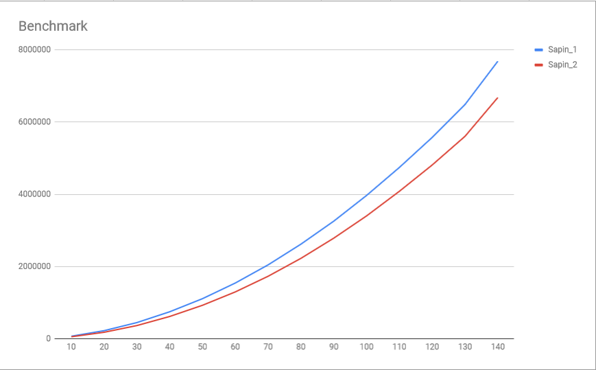

# Fir generator in Rust
```Rust
#![feature(duration_as_u128)]
use std::time::{Instant};


fn main() {
    let size : usize = 100;
    let mut now = Instant::now();
    sapin_1(size);
    println!("\nSapin_1 : {} ns", now.elapsed().as_nanos());
    now = Instant::now();
    sapin_2(size);
    println!("\nSapin_2 {} ns", now.elapsed().as_nanos());
}

pub fn sapin_1(_trh: usize) {
    for i in 0.._trh {
        println!("{0}{1}",
            (0..(_trh - i)).into_iter().fold("".to_string(), |mut acc, _| { acc.push_str(" "); acc }),
            (0..(i * 2)+1).into_iter().fold("".to_string(), |mut acc, _| { acc.push_str("*"); acc })
            );
    }
}

pub fn sapin_2(_max: usize) {
    let star : &str = "*";
    for i in 0.._max {
        let mut line : String = "".to_string();
        for _j in 0..(_max - i) {
            line.push_str(" ");
        }
        for _z in 0..(i*2)+1 {
            line.push_str(star);
        }
        println!("{0}", line);
    }
}
```
# Benchmark 

```
#![feature(duration_as_u128)]
use std::time::{Instant};


fn main() {
    for threshold in (10..1000).step_by(10) {
        let mut time_sapin_1 = Vec::new();
        let mut time_sapin_2 = Vec::new();
        for _run in 0..100{
            time_sapin_1.push(sapin_1(threshold));
            time_sapin_2.push(sapin_2(threshold));
        }
        println!("|| Threshold : {0}", threshold);
        println!("Sapin_1 | Time : {0} ns", mean_u128(time_sapin_1));
        println!("Sapin_2 | Time : {0} ns", mean_u128(time_sapin_2));
        // For csv
        //println!("{}, {}, {}", threshold, mean_u128(time_sapin_1), mean_u128(time_sapin_2));
    }
}

pub fn mean_u128(vec : Vec<u128>) -> u128 {
    return vec.iter().fold(0, |sum, i| sum + i) / (vec.len() as u128);
}

pub fn sapin_1(_trh: usize) -> u128 {
    let now = Instant::now();
    for i in 0.._trh {
        let _sapin = format!("{0}{1}",
            (0..(_trh - i)).into_iter().fold("".to_string(), |mut acc, _| { acc.push_str(" "); acc }),
            (0..(i * 2)+1).into_iter().fold("".to_string(), |mut acc, _| { acc.push_str("*"); acc })
            );
    }
    return now.elapsed().as_nanos();
}

pub fn sapin_2(_max: usize) -> u128 {
    let now = Instant::now();
    let star : &str = "*";
    for i in 0.._max {
        let mut line : String = "".to_string();
        for _j in 0..(_max - i) {
            line.push_str(" ");
        }
        for _z in 0..(i*2)+1 {
            line.push_str(star);
        }
        let _sapin = format!("{0}", line);
    }
    return now.elapsed().as_nanos();
}
```

Data :
```
|| Threshold : 10
Sapin_1 | Time : 72213 ns
Sapin_2 | Time : 56561 ns
|| Threshold : 20
Sapin_1 | Time : 224839 ns
Sapin_2 | Time : 181193 ns
|| Threshold : 30
Sapin_1 | Time : 449771 ns
Sapin_2 | Time : 366908 ns
|| Threshold : 40
Sapin_1 | Time : 749020 ns
Sapin_2 | Time : 620081 ns
|| Threshold : 50
Sapin_1 | Time : 1116662 ns
Sapin_2 | Time : 933856 ns
|| Threshold : 60
Sapin_1 | Time : 1540665 ns
Sapin_2 | Time : 1298244 ns
|| Threshold : 70
Sapin_1 | Time : 2098988 ns
Sapin_2 | Time : 1778538 ns
|| Threshold : 80
Sapin_1 | Time : 2618192 ns
Sapin_2 | Time : 2226316 ns
|| Threshold : 90
Sapin_1 | Time : 3250559 ns
Sapin_2 | Time : 2782752 ns
|| Threshold : 100
Sapin_1 | Time : 3953790 ns
Sapin_2 | Time : 3398007 ns
|| Threshold : 110
Sapin_1 | Time : 4724005 ns
Sapin_2 | Time : 4070842 ns
|| Threshold : 120
Sapin_1 | Time : 5558890 ns
Sapin_2 | Time : 4812837 ns
|| Threshold : 130
Sapin_1 | Time : 7380773 ns
Sapin_2 | Time : 6297425 ns
```


